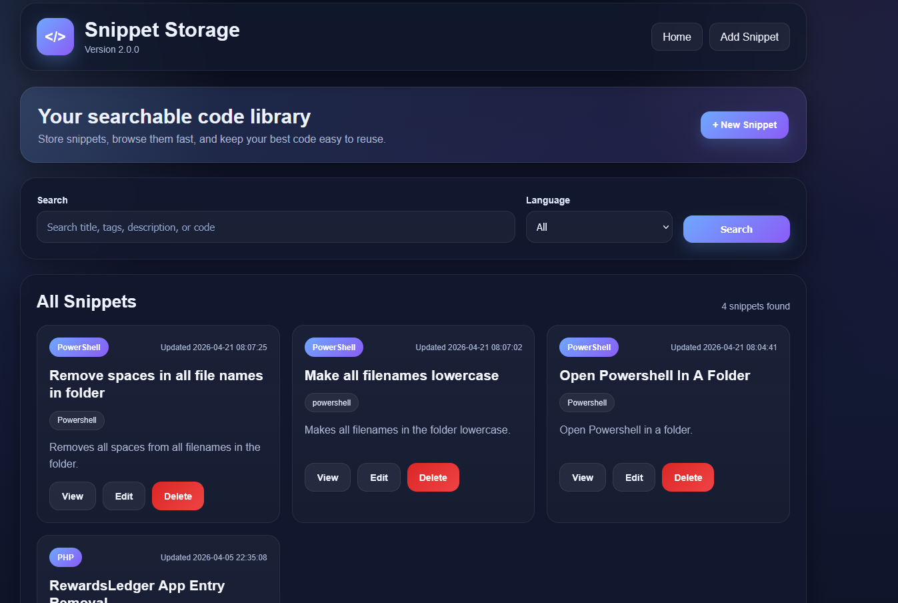
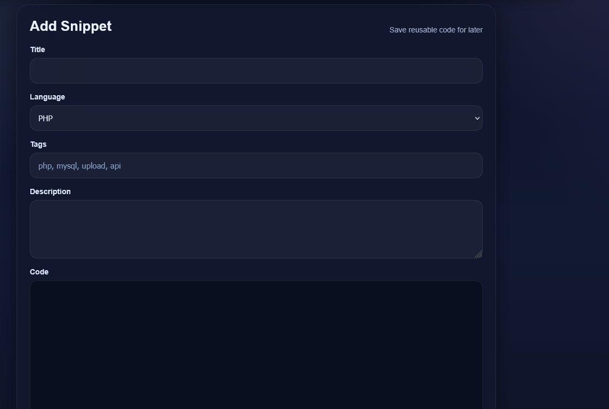
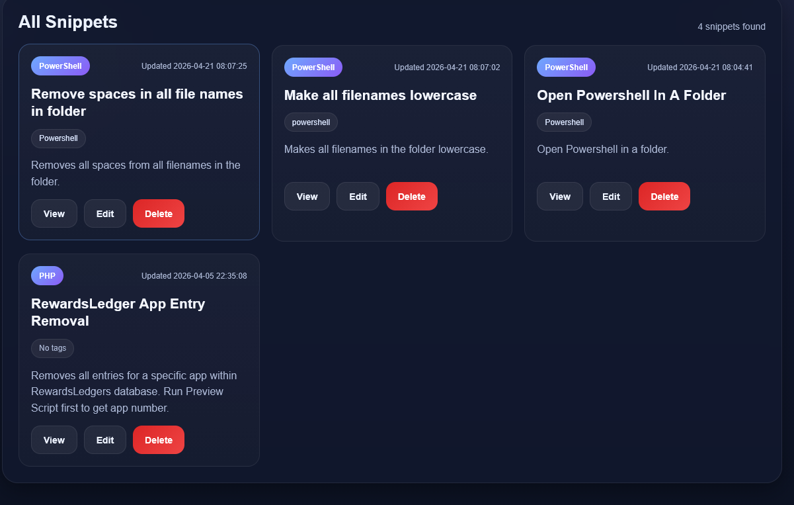

# 💾 Code Snippet Storage

<p align="center">
  <strong>Your searchable, organized code library — built for real development workflows.</strong>
</p>

<p align="center">
  Store snippets, search instantly, and keep your best code easy to reuse.
</p>

<p align="center">
  
  
  
  
</p>
---

<p align="center">
  
  
  
</p>

---

## 🚀 What is Code Snippet Storage?

**Code Snippet Storage** is your personal developer toolbox.

Instead of digging through old projects, random notes, or forgotten files, this app gives you a structured way to store and retrieve reusable code instantly.

Save it once. Find it forever.

---

## ✨ Features

* 🔍 **Instant search**

  * Searches title, tags, description, AND code

* 🏷️ **Tag-based organization**

  * Keep snippets grouped logically

* 💻 **Language filtering**

  * Quickly find relevant code

* 📝 **Full snippet management**

  * Create, edit, and delete easily

* ⚡ **Fast, clean UI**

  * Built for speed and clarity

* 🌙 **Dark themed interface**

  * Matches your full app ecosystem

---

## 🧠 Perfect For

* SQL queries you reuse often
* API request templates
* PowerShell / Bash scripts
* PHP utilities
* Debug helpers
* Anything you’ve ever said:
  *“I know I wrote that somewhere…”*

---

## 🛠️ Installation

1. Download the latest release ZIP

2. Extract into your web server directory

3. Configure your database in:

```
config.php
```

4. Open in your browser:

```
http://localhost/code-snippet-storage
```

---

## 💡 How It Works

### ➕ Add Snippets

* Title
* Language
* Tags
* Description
* Code block

---

### 🔎 Search Everything

Search across:

* Titles
* Tags
* Descriptions
* Code

---

### ⚙️ Manage Snippets

* View
* Edit
* Delete
* Filter by language

---

## 🔗 Related Projects

* **Project Menu** — Launch and manage all your apps
* **RewardLedger** — Track income, rewards, and assets
* **Budgeter II** — Paycheck-based budgeting system

---

## 👨‍💻 Developer

Developed by **Raymond Russelburg**

---

## 📄 License

MIT License — free to use, modify, and distribute.

---

<p align="center">
  Built for developers who are tired of losing good code.
</p>
